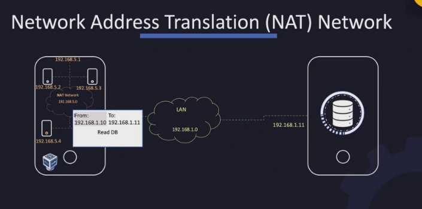
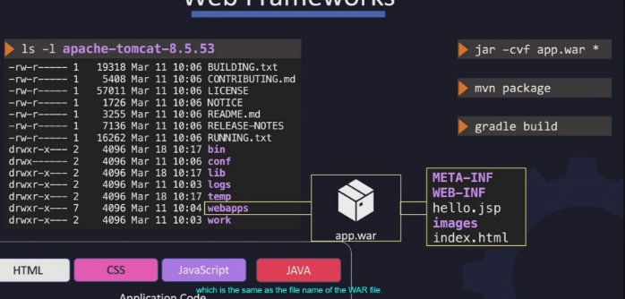

TAG#1:

Basics-

- basic commands like echo,ls,cd
- allows to create directories inside directories if the directories are not present
- mv one\_file second\_file (if in the same directory it just means renaming)

rm

cp -r

- some commands like su, sudo etc
- how sudo allows you to have root priviledges without being root user (use sudo prefix)

` `    

- using -o tag to save the file in the cd otherwise it will just print the file
- we can also use the wget command to download a file

Syntax for both:

-curl..link..-o

-wget ..link..-ofile\_name.txt

How to check id of an user?

- Short answer : Using the command id -u <name>
- Long answer : That info is stored in /etc/passwd

PACKAGE MANAGER:

- They help you install various softwares in our linux system. -CentOSuses an RPMbased packet manager.
- The packages come in the format of .rpm
- And to install them we use the command : rpm -i package\_Name.rpm -rpm -e uninstalls a package.

-rpm -q gives us info about the installed package (THIS CAN BE USED TO CHECK IF THE RPM IS INSTALLED IN THE SYSTEM OR NOT))

-> But majordismerit of rpm package management is that they do not install additional dependencies.

that may be required by our installed package, so in package managers like comes in play

->yum install ansible (installs all the dependencies along with the main software) ->yum remove ansible (removes the file)

->yum install ansible-2.9.1 (installs this particular version)

(NOTE: Don't forget to use sudo command if you are not the root user)

SERVICES:

- A service is a program that runs in the background outside the interactive control of system users as they lack an .
- So any software that runs as a service in background is installed like docker,httpd,etc they are automatically configured as a service in the system.
- And now to start this service we use the command

service httpd start (just taking httpd as an example here)

- The newer version of starting the service is by using

systemctl start httpd

- BOTH DOES THE SAME THING SO LETS STICK TO THE systemctl
- NOW to stop a service systemctl stop httpd
- To check the status of a service systemctl status httpd
- To make the service to start automatically when the system boots up we use systemctl enable httpd
- And to disable

systemctl disable httpd

-> We just saw that systemctl command is used to manage services, so let say we have a program that is to be used as service, we can do so my configuring our program as a systemd service.

- A systemd service is configured using asystemd unit file.
- These file may be located at etc/systemd/system path.
- So we have to create the unit file in that path and name it what the service is

to be named(with the extension .service)

- Inside the file define a section called service using the square brackets

provide a directive named ExecStart under it.

It should look like this:

[Service]

ExecStart = <command we will use to run the application>

- use the command daemon-reload, it lets the systemd know there is a new

service configured.

- Then do whatever you want to do with the service - start, enable,etc but wait

enable will not work unless

we further modify the unit file, another section with directive is needed.

[Service]

ExecStart = <command we will use to run the application> [Install]

WantedBy = multi-user.target

- We can also add further metadata to give others for info about what this

application does in the unit section.

[Unit] Description=safjbasd

- If our program has commands or scripts that are to run before or after

starting the application we add:

Also if we want the application to restart if in case of crash or something

[Service]

ExecStart = <command we will use to run the application>

ExecStartPre = .... ExecStartPost = ..... Restart = always

TAG#2:

Virtualisation -

- Type-1 : Installed directly on top of the physical server. E.g : Microsoft Hyper-v
- Type-2 : Layer of host OS that sits between the physical server and the HVs.

NETWORKING IN VIRTUAL BOX:

- Each VM has 4 adapters.
1. Private Host-only network :

-> Private network within our PC and the VMs are connected to this network and

get addr of the same series, and even our PC gets a new addr(same series). -> The connectivity is contained within the host which doesn't allow info exchange between different hosts/pc.

-> Internet connectivity is possible with enabling IP forwarding.

2. NAT network:

->Network Address TranslationNetwork acts the same way but allows communication with the outer world.

-> NAT engine replaces the source IP with its own IP address, so the outside world will have no idea of the

presence of the VMs. This is known as network address translation.

-> No system outside the host cannot access the VMs inside.

-> Internet connectivity is possible.

NAT vs NAT network:

- In NAT the internal network is not present between the VMs of the host, but the individual VMs are able to

communicate with the outside world.

3. Bridge Network:

-> It is always present unlike host only or NAT.

-> If we want to access the inside VMs or services from outside.

-> The IP address assigned are of the original LAN series. (see image)

PORT FORWARDING:

- It allows us to map a port from the host to the guest.

TAG#3:

- We can change the VM name in vagrant (further info in vagrant documentation)

NETWORKING PRE-REQ:

->Switching:

- Two systems are connected to each other using a switch, and the switch creates a network containing the two systems.
- To connect them to a switch we need an "interface" on each hosts physical or virtual depending on the host.
- To see the interfaces for the host we use the command.
- These two form a network with the help of this switch.
- To add an ip address to that system using the command

ip addr add <ip\_address> dev <interface>

->Routing :

- Now if we need to a router comes

into play.

- A router is just another device in a network, what it means is that how can

our packets of information know where even is the router present in this network for inter-network data transfer.

- That's where we configure a system using a gateway, it is like a door rather

than a room(other systems), which acts as a gate to other networks.

- To see the existing routing configuration on a system, use the route

command, it displays the kernel's routing table.

- We need to add the info using the ip route add command (see image for

more detail)

-ip default gateway : Any network outside of your existing network goes to that particular router. 0.0.0.0

- Packets are not forwarded from one interface to the next in linux unless explicitly defined.
- It can be done in a directory by changing the value from 0 to 1.

SUMMARY:

1. ip link : To list and modifiy interfaces on the host.
1. ip addr : To see the ip addresses assigned to that host.
1. ip addr add : Used to set IP addresses on the interfaces.
1. ip route add <ip1\_address> via <ip2\_address>

TAG#4:

DNS:

- We can change name of a system on a network by modifying the files in /etc/hosts directory.
- Whatever name we put in the hostfile for a system is the absolute truth for the other systems in the network.
- They do not check whether the name is correct or not.
- We can have many names we want and for as many servers as we want in the etc/hosts file.
- TheDomain Name System(DNS)is a hierarchical and distributed naming system for computers, services, and other resources in the Internet or other Internet Protocol networks.
- DNS is basically areplacement to the etc/hosts file as we it is very tedious and non-optimal as for every system in the network we need to modify the

etc/hosts file to specify the names.

- In DNS a single entity in the network holds all the recipient names and ip addresses.
- Every host has a DNS resolution configuration file at . You add an entry into it specifying the address of the DNS server.

name\_server <ip\_address>

- Priorityis etc/hosts and then the DNS server. So if there are entries in both the places, etc/hosts one is chosen.
- But that order can also be changed in the 

->CONCEPT OF DOMAIN NAMES :

- Lets take an example:

www, maps, apps - is the sub-domain www.google.com, maps.google.com

google - is the domain name provided to google .com - Top level domain name

. - is called the root

- Let say we want to visitfrom our organization, our request

first hits the organization's DNS server, as it doesn't know who or what drive or google is, so it forwards our request to the internet where the ip address of the server serving drive.google.com may be resolved with the help of multiple DNS servers.

- Look at the search domain image.

NSLOOKUP:

TAG#5:

JAVA Building an application:

- A java file is first compiled intobytecode using the javaccommand.
- Then we can run the file using the Java<class\_name> command.
- But a tyical application may have many such files, here comes the play from
- A(Java ARchive) is apackage file forma t typically used to aggregate many Java class files and associated metadata and resources (text, images, etc.) into one file to distribute application software or libraries on the Java platform.
- JAR files are similar to ZIP files, but they have amanifest file that describes the contents of the JAR file and can hold additional metadata about the files inside the JAR.
- Now to create an archive we use the jar command followed by the name of the archive and then pass in the list of files that are needed in the archive.

e.g -

|    ||
| - | - |
|||
- Now when the jar file is created it also generates a manifest file in the path META-INF/MANIFEST.MF

This file contains info about any file present in the archive and also any metadata regarding the application.

- One such info is the entry point of the installation when someone tries to run this packaged version of the application.

So it needs to be specified as a main class property within the manifest file.

- Now this package can be run on any system with the java command e.g :

-> Now in a realistic environment many of these build processes may be very complex as numerous developers are working on the same application and may be hard to keep up with everything individually.

- Here come the application of java build tools like which helps us in automate the process.
- These tools use configuration files where we can specify the steps we want the build tool to automate.

E.g : lets consider ant

- just typing the command ant is enough to do all the steps for running a jar

file.

- if we just want to compile (or doc or anything) use it like this ant compile jar
  - we need to be in directory where the jar file is.

NodeJS:

- It allows you to run JavaScripton the server side, which can be used to build server-side applications with JavaScript.
- It is an open-source, cross-platform runtime environment that executes JavaScript code outside a web browser.
- The Node.js package ecosystem, npm, is the largest ecosystem of open-source libraries in the world.
- The characteristic that separates NodeJS from others is its ability to handle large number of concurrent connections by implementing a non-blocking IO model.
- Install NodeJs in CentOS using these commands :

`  `    

` `   

NPM :

- Like any programming language, NodeJS supports a large number of packages and libraries.
- These could be packages for working with files, hosting web servers, interacting with databases, implementing security etc.
- When we install NodeJS,npm is also simultaneously installed alongside.
- We can search using for a package using npm search <package\_name>.
- And install usingnpm install <package\_name>.
- When a package is installed it installed in the

node\_modules/<package\_name> directory.

- And all the files like readme, license is created there, and the main code is present in the lib directory.
- There's also a file named package.json and it contains the metadata for the package, such as its name, version author etc.
- We can install the libraries in two ways or purposes
  - one for the application we building
  - other for the whole system
- When we install using npm command without any options it assumes that you want to install the package in the cd.
- using the -g tag installs the package globally.

MODULES :

- In Node.js, a module is a piece of code that can be reused in other parts of your application. There are two types of modules in Node.js:built-in modules and external modules.
-  : These are the modules that are compiled into the Node.js binary. Examples include the fs (file system) module, the http module, and the path module.
-  : These are modules that are created by developers and are saved in separate files. They can be installed using the npm package manager and imported into a Node.js script using the require function.

(see image).

- So an application or a package has a set of dependencies and scripts associated with it.These are recorded in the package.json file.

TAG#6:

PIP (Python package manager) :

- There could be two separate versions of python in our system.
- Similarly there are two PIP versions are there as well. pip2 and pip3.
- pip is a package management system for Python that is used to install and manage software packages written in Python.

e.g pip install <package\_name>

pip uninstall <package\_name>

-pip show <package\_name> : It displays the location of the particular

package.

- requirements.txt is a file that lists the dependencies for a Python project, as well as the versions of each package required.

TAG#7:

APACHE WEV SERVER :

-httpd (Hypertext Transfer Protocol Daemon) is a software program that runs in the background of a server and listens for incoming requests from clients on the internet. It is the most widely-used web server software, and is the main component of the Apache HTTP Server, which is a free and open-source web server.

- to install httpd service in our host system just use
- Then we can either start or enable to get going.

 

|yum install|httpd|
| - | - |
|||

- Every server has a configuration file where we can configure the different parameters that govern how the server operates such as what port it listens on etc,
- For the APACHE web server it is stored in the/etc/httpd/conf/httpd.conf
- Now to access the page hosted by the http server go to port 80 on local host. https://localhost:80
- The document root defines the location where the static content is stored.
- Somoving the static files into this directory, you will see the custom directory.
- As we know a single apache server can hold multiple websites, to do that the files and configuration of each website is configured as virtual hosts within the apache configuration file. Thus a virtual host is a division of different websites in a apache webserver.
- This information can be be mentioned as shown in image (virtualhost).

- Also another important thing is to restart the httpd service after making a change in the config file.
- To make the configuration file small, new configuration can be created (as shown in multipleconfig) and we just need to use the include statement in the original configuration file.

APACHE TOMCAT :

- It provides a web server environment where we can host Java-based web applications.
- Apache tomcat server runs on the port 8080.
- Now to deploy a web application on a tomcat server we need to package our code in a WAR package.
- Once the code is packaged move the WAR file into the webapps directory of the server (check tomcatweb)

- Now if the tomcat server is running, it automatically detects that an application has been placed in the webapps directory and the server will extract the war file into a directory in its name.

TAG#8:

DATABASES:

-SQL databases use a structured query language for defining and manipulating the data in the database. These databases are based on the relational model, which organizes data into tables with rows and columns.

- Each table has a specific schema that defines the structure of the data it

contains, and relationships between tables are established using foreign key constraints.

-NoSQL databases, on the other hand, do not use a fixed schema and do not rely on the relational model. Instead, they employ a variety of data models, such as key-value, document, columnar, and graph. These databases are designed to handle large amounts of unstructured and semi-structured data, and they can scale horizontally across multiple machines.

MYSQL :

- Now to first use my SQL in a linux based system, we need to download the rpm package using the wget command.
- Then install the rpm package using rpm command.
- Also install the MySQL server using theyum install mysql-server command. (refer to mysqlinstall)

- And start the service using systemctl command.
- The database log is saved in /var/log/mysqld.log
- It listens on port 3306 by default.
- To connect to the database use the mysql client utility but we need a password (this is available in the log file)

- Now once inside the mysql prompt, the first step is to change the default password as no other options are allowed before that.
- creating a user in mysql :

|CREATE USER'mynewuser'@'localhost' IDENTIFIED|BY 'mypasswor|
| - | - |
|||
d';

MONGODB:

- It’s a noSQL database and stores data in a json like format. This is known as a document, and multiple documents together form a collection. Mutliple collection together form a database. And we can store many such databases in a single MongoDB server.
- Same as mysql we need to download mongodb server on our system and then enable it as a service.
- Thelogs are stored in /var/log/mongodb/mongod.log
- Theconf file of mongoDB is present in /etc/mongod.conf
- Just typingmongo command we can connect to the database.
- To display a list of databases use show dbs command.
- To create a new database or switch to a database, USEcommand is used.
- To create a new collection use - db.CreateCollection("<collection\_name>")
- To show existing collection in the database use show collections command.

SECURITY :

- ATLS certificateis used to guarantee trust between two parties during a transaction.
- Example, When a user tries to access a web server TLS certificates ensure that the communication between the user and the server is encrypted and the

server is who it says it is.

-Symmetric encryption, also known as secret key encryption, is a method of encrypting data where the same key is used to encrypt and decrypt the data. The key is kept secret and is shared between the sender and the receiver of the data. The sender uses the key to encrypt the data, and the receiver uses the same key to decrypt the data.

- This is whenassymmetric encryption comes to play, instead of using a single key to encrypt and decrypt data it uses a pair of keys, a private and a public key.
- We can generate key pairs using the command ssh-keygen.
- Acertificate is a type of digital document that binds a public key to an identity. Certificates are issued by a certification authority (CA) and they contain information about the identity of the owner of the certificate (such as their

name and address), the public key, and other information that is used to verify

the identity of the certificate's owner. The key point is that the certificate must

be signed by the issuer themselves and cannot be faked. And our web browser checks this sign to verify the security.

- Now in our own webserver if we want a secure certificate sign, Cerificate authority or CA comes into play.
- They are organizations that can sign and validate your certificates for you. Some of the popular ones are Symantec, Digicert, Comodo.
- The way it works is as follows, you generate a certificate signing request or CSR using the key generated earlier and the domain name of your website.

i.e openssl req -new -key my-bank.key -out my-bank.csr

- The certificate authorities verify the details and once it checks out they sign the certificate and sends it back to you.
- So when scammers/hackers try to create fake websites, their authorization fails as the CA makes sure of it.
- The two key pairs generated are a private key and public key. We must encrypt the data using the public key and decrypt using the private, and shouldn't do vice versa.
- Some naming conventions : certificates with public key are named .crt or .pem extension.

certificates with private key are named .key or -key.pem

TAG#9:

YAML:

- YAML is ahuman-readable data serialization format. It is often used for configuration files, and can be used in a wide variety of programming languages. YAML is designed to be easy for humans to read and write, and easy for machines to parse and generate.
- The key and value is separated by a : (also a space after colon).
- and is shown in (yamlEG)
- The amount of indentation should be same for all the key value pair in a map/dictonary.
- Map/dictonary is not ordered but list/array are ordered list. (check yamlOR)

JSON PATH:

- JSON path is aquery language that can help you parse data represented in a JSON or YAML format.

(check jsonbrief for an idea) also (check jsonroot)

- JSON path lists is also shown here.

- Check an example shown in jsoneg1.

